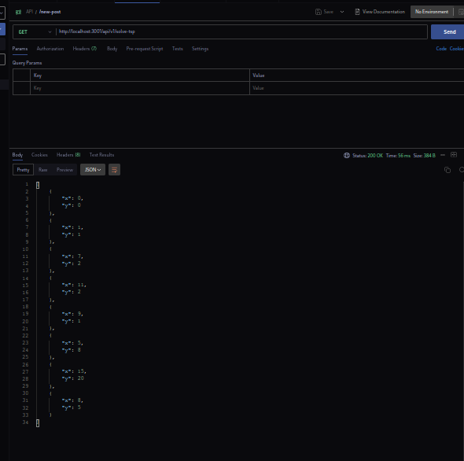

# Sistema de Gerenciamento de Clientes

Este é um projeto de Sistema de Gerenciamento de Clientes com foco na arquitetura hexagonal e na solução do problema do Traveling Salesman Problem (TSP). O objetivo principal deste projeto é criar uma plataforma para uma empresa de limpeza residencial que enfrenta desafios no gerenciamento de clientes e busca uma solução eficiente para centralizar e visualizar as informações que atualmente são controladas em planilhas.

## Funcionalidades

- Listar os clientes cadastrados e filtrar com base nas informações como nome, email e telefone.
- Cadastrar novos clientes com nome, email, telefone, coordenada X e coordenada Y.
- Calcular a rota mais eficiente para visitação dos clientes cadastrados, partindo da empresa e retornando no final, utilizando o algoritmo TSP.

## Tecnologias Utilizadas

- Backend em Node.js com arquitetura hexagonal.
- Banco de Dados PostgreSQL.
- Frontend em React.
- Docker.

## Iniciar Aplicação
``
$ docker-compose -f docker-compose.build.yml up -d --build
``

Endereço da url para consultar as rotas:
Método GET
http://localhost:3001/api/v1/solve-tsp

## Resultado

## Licença

Este projeto está licenciado sob a [MIT License](LICENSE).